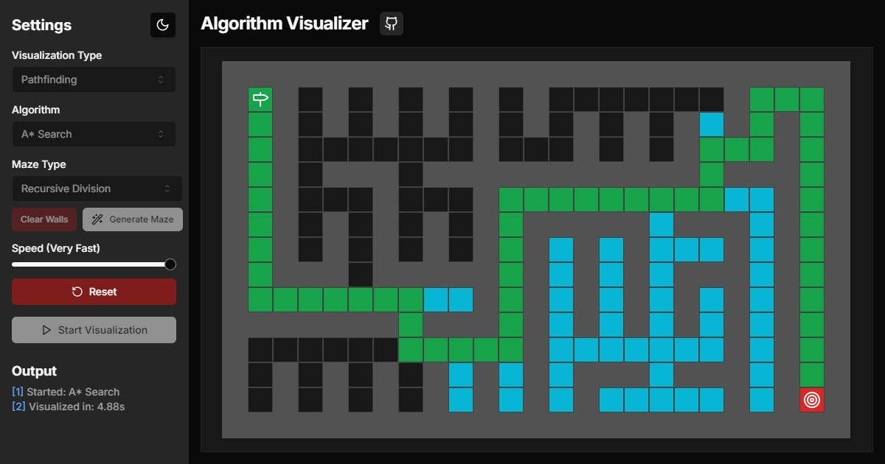

# Algorithm Visualizer

A web application for visualizing popular pathfinding and sorting algorithms built with [Next.js](https://nextjs.org/), [React](https://reactjs.org/), [TypeScript](https://www.typescriptlang.org/), and [Tailwind CSS](https://tailwindcss.com/).



## Features

### Pathfinding

- Visualize:
  - **Dijkstra's**
  - **A\* Search**
  - **Greedy Best-First Search**
  - **Depth-First Search (DFS)**
  - **Breadth-First Search (BFS)**
- Interactive and resizable grid for drawing walls and dragging start/end nodes
- Generate and visualize mazes using **pseudo-random**, **binary tree**, or **recursive backtracking** algorithms

### Sorting

- Visualize:
  - **Bubble Sort**
  - **Selection Sort**
  - **Insertion Sort**
  - **Merge Sort**
  - **Quick Sort**
  - **Heap Sort**
- Generate random arrays
- Customize the size of arrays

### General

- Light/dark mode
- Adjustable visualization speed

## Getting Started

To set up the project locally, follow these steps:

1. **Clone the repository:**

   ```bash
   git clone https://github.com/tariqs26/algorithm-visualizer.git
   ```

2. **Navigate to the project directory:**

   ```bash
   cd algorithm-visualizer
   ```

3. **Install the dependencies:**

   ```bash
   npm install
   ```

4. **Start the development server:**

   ```bash
   npm run dev
   ```

   The application will be running on `http://localhost:3000`.

## Available Scripts

Inside the project directory, you can run the following scripts:

| Command          | Description                           |
| ---------------- | ------------------------------------- |
| `npm run dev`    | Starts the development server         |
| `npm run build`  | Builds the application for production |
| `npm run start`  | Runs the production server            |
| `npm run lint`   | Lints the codebase using ESLint       |
| `npm run format` | Formats the code using Prettier       |
